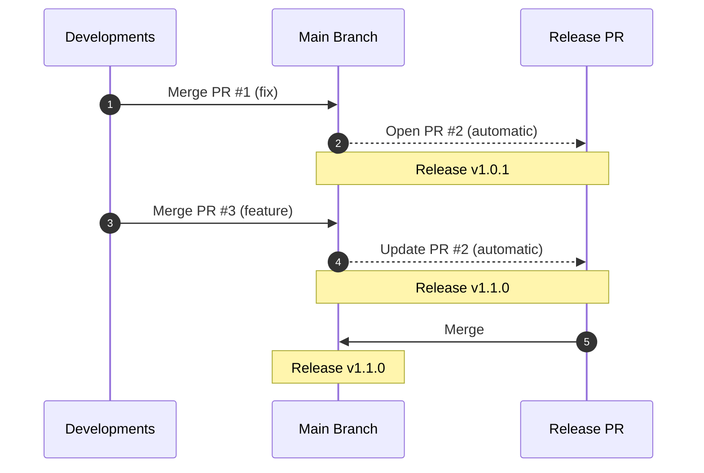
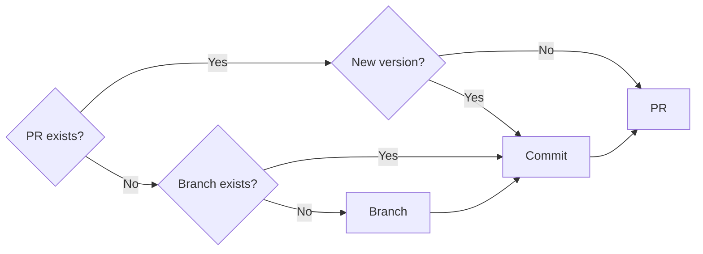

# Release Action

PR-based Github Action for releasing Node.js projects.

> :warning: **This project is still in experimental phase, it is subject to
> breaking changes and therefore not suitable for production.**

[Issues](https://github.com/cyberspace7/release-action/issues) can be tracked
[here](https://github.com/orgs/cyberspace7/projects/2), don't hesitate to upvote
issues you want to be treated.
If you have any question, remark, suggestion, ... They are most welcome in the
[discussions](https://github.com/cyberspace7/release-action/discussions)!

## Description

It can be quite a hassle to find a proper release process that meet simple but
specific and multiple demands, such as:

- To bump automatically the version based on changes type (patch, minor, major);
- To only modify `package.json`;
- To be able to ignore a specific change;
- To handle releases through a release PR;
- To create a GitHub release;
- To be able to override the version;
- To release as pre-release (both the version number **and** the GitHub release);
- Etc...

Some tools get close but not enough. That's exactly why Release Action exists: it is a simple
automation tool for releasing Node.js projects on GitHub based on pull requests and labels.
You can easily integrate it into your workflow as it only creates a
GitHub release when a specific PR is merged. It works in two phases:

1. **Prepare**: Gets all merged PRs since last release, determines the next version based
   on labels (major, minor, patch) unless overriden (see [inputs](#inputs)) and creates
   (or updates) a pull request including the updated `package.json` file;
2. **Release** (actually runs first): Once the release PR merged, a release is made on GitHub, that's it!



Below is the prepare process when new changes are detected:



### When it should be used

It should be used if:

- Commits are systematically pushed to the main/production branch **through pull requests**;
- Labels are used in PRs to classify the type (patch, minor, major);
- The release commit is just about updating the `package.json` file.

### When it should not be used

It should not be used if:

- Commits are **pushed directly** to the main/production branch;
- The release commit must include more than updating the `package.json` file,
  such as a changelog (the changelog is generated in the PR body and GitHub release).

## Usage

Release Action is designed to be ran every time there is a change on the main/production branch.
Here is a recommended workflow setting:

```yaml
name: Release

on:
  push:
    branches:
      - main
  workflow_dispatch:
    inputs:
      release-as:
        type: string
        description: Force the release version
      pre-release:
        type: choice
        default: ""
        description: Pre-release
        options:
          - ""
          - alpha
          - beta
          - rc

permissions:
  contents: write
  pull-requests: write

env:
  GITHUB_TOKEN: ${{ secrets.GITHUB_TOKEN }}

jobs:
  release:
    name: Release
    runs-on: ubuntu-latest
    steps:
      - name: Checkout repository
        uses: actions/checkout@v3
      - name: Execute action
        id: action
        uses: cyberspace7/release-action@v0.1.0
        with:
          release-as: ${{ inputs.release-as }}
          pre-release: ${{ inputs.pre-release }}
```

> :warning: Use a manual version (`v0.1.0` in the example) until a `v1` becomes available.
> Remember that this version **is not production ready**.

> :bulb: **Tip:** Use the `is-released` output (see [outputs](#outputs)) to execute
> another job to deploy the fresh release (i.e. create a package, deploy a Docker container,
> etc.).

When opening a PR on the `main` branch, use one (or more) of the following labels in
order to bump the version to the right level. They can be customised through [inputs](#inputs).

- `type: fix`: Bump the **patch** part of the version.
- `type: feature`: Bump the **minor** part of the version.
- `breaking`: Bump the **major** part of the version, or minor if current version is under `1.0`.
- `changelog-ignore`: Dont bump whatever other labels are. It should be excluded from
  the release notes generation (see bellow).

That's it, when merged, you should find an open release PR. You just have to merge it when you wish to release, voilà !

Changes are found comparing GitHub
[generated release notes](https://docs.github.com/en/repositories/releasing-projects-on-github/automatically-generated-release-notes),
therefore it's advised to have a `.github/release.yml` file excluding release PR labels and
the ignore label so that they don't appear as changes:

```yaml
changelog:
  exclude:
    labels:
      - "changelog-ignore"
      - "release: ready"
      - "release: done"
```

Something's missing? Check if it's planned in
[issues](https://github.com/cyberspace7/release-action/issues), upvote it, or share your
thoughts in the [discussions](https://github.com/cyberspace7/release-action/discussions).
Don't hesite also to share your experience.

### Permissions

This action requires the following permissions in order to work:

```yaml
permissions:
  contents: write
  pull-requests: write
```

### Inputs

| Name           | Description                                                                                                               | Default Value      |
| -------------- | ------------------------------------------------------------------------------------------------------------------------- | ------------------ |
| `release-as`   | Force a specific version.                                                                                                 |                    |
| `pre-release`  | Name of the pre-release version (`alpha`, `beta`, `rc`...). If not empty, will trigger a pre-release.                     |                    |
| `label-ignore` | Label for pull requests to be ignored for the release bump. It should be added to changelog excluded labels (see #usage). | `changelog-ignore` |
| `label-patch`  | Label for pull requests to bump a patch version.                                                                          | `type: fix`        |
| `label-minor`  | Label for pull requests to bump a minor version.                                                                          | `type: feature`    |
| `label-major`  | Label for pull requests to bump a major version.                                                                          | `breaking`         |
| `label-ready`  | Label automatically used by Release Action for release PRs.                                                               | `release: ready`   |
| `label-done`   | Label automatically used by Release Action for release PRs that have been processed (current version released).           | `release: done`    |

### Outputs

| Name              | Type      | Description                                |
| ----------------- | --------- | ------------------------------------------ |
| `current-version` | `string`  | Version of the current code.               |
| `next-version`    | `string`  | Version of the next release.               |
| `release-pr`      | `number`  | Number of the opened release pull request. |
| `is-released`     | `boolean` | Current version has been released.         |

### Secrets

_None._

### Environment variables

| Name           | Description                                 |
| -------------- | ------------------------------------------- |
| `GITHUB_TOKEN` | Authentification token used for GitHub API. |

## Development

See [`package.json`](package.json) for the list of available scripts.

### Prerequisites

This project require the following dependencies:

- [Node.js](https://nodejs.org)
- [pnpm](https://pnpm.io)

### Setup

Install the dependencies:

```bash
pnpm install
```

### Build

[Source files](src) are are compiled into a single file with all dependencies, into [`dist`](dist).
The `dist` directory must be commited into the repository.

```bash
pnpm build
```

### Release

Releases are automatic, following the merge of the release pull request (see [Release Action](https://github.com/cyberspace7/release-action#readme)).
A release PR can be explicitely generated by running manually
[this workflow](https://github.com/cyberspace7/release-action/actions/workflows/release.yml).

## Authors

- [**Benjamin Guibert**](https://github.com/benjamin-guibert) – main author and contributor.

## Contributing

Submit a feature request or any idea to improve the project, as it is greatly appreciated,
in the [discussions](https://github.com/cyberspace7/release-action/discussions/categories/ideas).

If you find a bug concerning this project, please fill a [bug report](https://github.com/cyberspace7/release-action/issues/new?assignees=&labels=bug-report&projects=&template=bug-report.yml).
If it concerns a security vulnerability, please email us at `contact@a60.dev`.

For contributing, please check the [guidelines](.github/CONTRIBUTING.md).

## Licensing

This project is licensed under the [MIT License](LICENSE).
